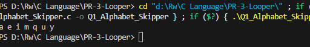
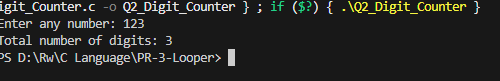
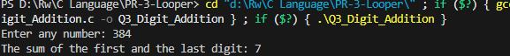
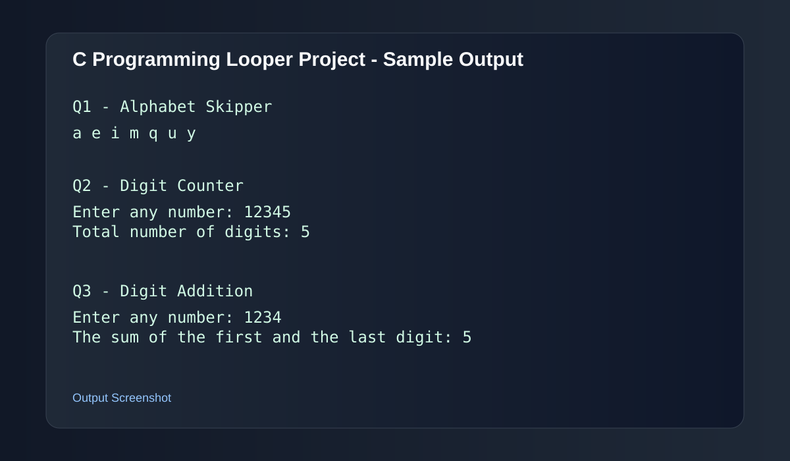

# PR-3-Looper

This project contains C programs based on loop-based programming questions. Each program demonstrates the use of loops and basic input/output operations in C.

## Project Title
PR-3 - Looper

## Program Questions

### Q1. Alphabet Skipper
Write a C program to print alphabets by skipping 4 letters in sequence.

Example output:
```text
a e i m q u y
```



### Q2. Digit Counter
Write a C program to count the total number of digits in a number.

Example output:
```text
Enter any number: 12345
Total number of digits: 5
```



### Q3. Digit Addition
Write a C program to find the sum of the first and last digit of a number.

Example output:
```text
Enter any number: 1234
The sum of the first and the last digit: 5
```



---

## Output Screenshot

The sample output for the project is shown below:



---

## Video Link

Demo video: [Add Your Video Link Here]("https://drive.google.com/drive/folders/1pZ_w3zK9Ab8G19dIIcipFgDwmkBgvF7u?usp=sharing")


---


