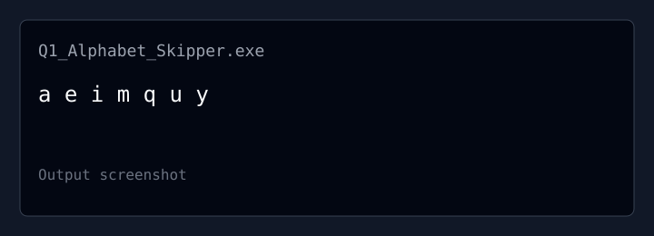
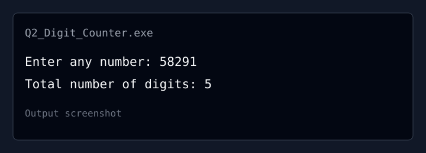
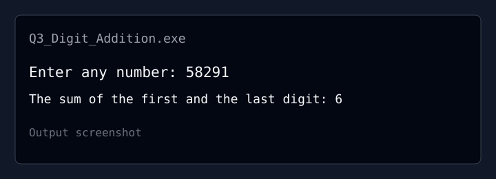

# PR-3: Looper Programs in C

This practical contains three C programs that demonstrate the `do...while` loop.

## Questions

### Q1. Alphabet Skipper

Write a C program to print lowercase alphabets by skipping three alphabets after
each printed character.

Source file: [Q1_Alphabet_Skipper.c](Q1_Alphabet_Skipper.c)

Expected output:

```text
a e i m q u y
```



### Q2. Digit Counter

Write a C program to accept an integer and count the total number of digits in
that integer using a `do...while` loop.

Source file: [Q2_Digit_Counter.c](Q2_Digit_Counter.c)

Example run:

```text
Enter any number: 58291
Total number of digits: 5
```



### Q3. Digit Addition

Write a C program to accept an integer, find its first and last digits, and
display their sum using a `do...while` loop.

Source file: [Q3_Digit_Addition.c](Q3_Digit_Addition.c)

Example run:

```text
Enter any number: 58291
The sum of the first and the last digit: 6
```



## How to Compile and Run

Use a C compiler such as GCC from this folder:

```bash
gcc Q1_Alphabet_Skipper.c -o q1
./q1

gcc Q2_Digit_Counter.c -o q2
./q2

gcc Q3_Digit_Addition.c -o q3
./q3
```

On Windows, run the generated `.exe` file instead, for example `q1.exe`.

## Video Demonstration

Add the uploaded demonstration recording here:

[Watch the video demonstration](https://drive.google.com/drive/folders/1pZ_w3zK9Ab8G19dIIcipFgDwmkBgvF7u?usp=drive_link)

Replace `REPLACE_WITH_VIDEO_ID` with the actual YouTube video ID after the
recording is uploaded.

